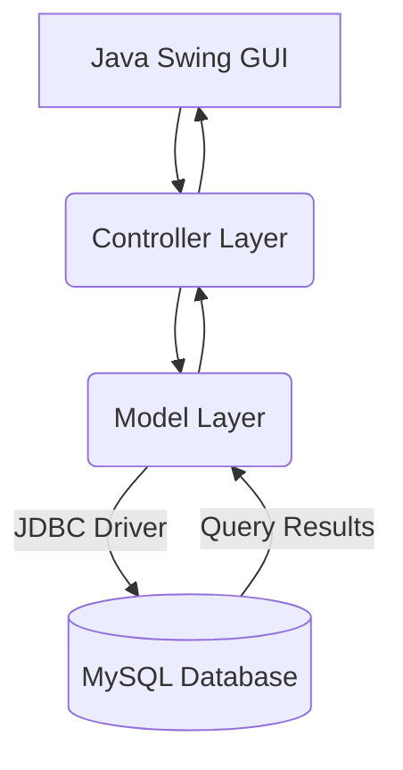

<div align="center">
  
  
  # 🏦 Bank Management System
  
  <p>
    
    
    
  </p>
</div>

## 📖 Overview
The **Bank Management System** is a robust desktop application designed to handle critical banking operations securely. Developed strictly in Java with JDBC integration, this software highlights core Object-Oriented design principles and efficient RDBMS data management.

## ✨ Features
- **User Authentication:** Secure login and registration flows for customers and administrators.
- **Account Operations:** Deposits, withdrawals, and inter-account fund transfers.
- **Transaction History:** Persistent logging of user activity stored in SQL.
- **Admin Dashboard:** Tools for bank managers to view user stats and authorize new accounts.
- **ACID Compliant:** Ensures bulletproof transactional integrity.

## 🛠️ Tech Stack
- **Frontend / UI:** Java Swing / AWT
- **Backend Logic:** Core Java
- **Database:** MySQL
- **Connector:** JDBC

## 📂 Folder Structure
```text
Bank_Management_System/
├── src/
│   ├── view/
│   ├── controller/
│   ├── model/
│   └── Main.java
├── db/
│   └── schema.sql
├── lib/
│   └── mysql-connector-java.jar
└── README.md
```

## 🚀 Installation

1. **Clone the repository:**
   ```bash
   git clone https://github.com/Satishkumara3/Bank-Management-System.git
   cd Bank-Management-System
   ```
2. **Setup the Database:**
   Import `db/schema.sql` into your local MySQL server.
3. **Configure Connection:**
   Update the database credentials in `src/model/DatabaseConnection.java`.

## 💡 Usage

Compile and run the main application:
```bash
javac -d bin -sourcepath src src/Main.java
java -cp bin;lib/mysql-connector-java.jar Main
```

## 📸 Screenshots
<div align="center">
  
  <p><i>The Bank Dashboard UI</i></p>
</div>

## 🏗️ Architecture Diagram


## 📊 Results
- Demonstrated complete MVC (Model-View-Controller) architecture.
- Prevented race conditions and data anomalies using strict SQL constraints.

## 🔮 Future Improvements
- Migrate to Java Spring Boot for a web-based REST API.
- Port frontend to a React.js application.
- Implement two-factor authentication (2FA).

## 📜 License
Provided under the MIT License.

## 🙏 Acknowledgements
- Oracle Java Documentation
- MySQL Open Source community
