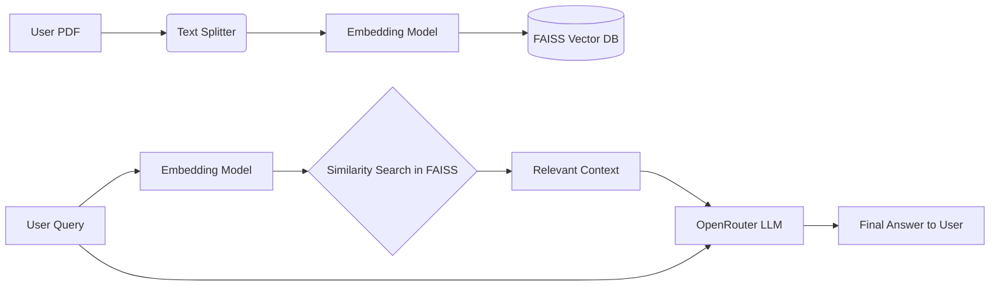

<div align="center">
  
  
  # 📄 Gen AI Document Studio
  
  <p>
    
    
    
  </p>
</div>

## 📖 Overview
**Gen AI Document Studio** is an advanced Retrieval-Augmented Generation (RAG) system built with LangChain, FAISS, and OpenRouter LLMs. It empowers users to converse intelligently with their PDF documents, extracting precise insights and summaries seamlessly via a modern Streamlit interface.

## ✨ Features
- **Intelligent QA:** Chat directly with your documents and get accurate, context-aware answers.
- **RAG Architecture:** Avoids hallucination by querying vectorized document chunks via FAISS.
- **Multi-Document Support:** Upload and process multiple PDFs simultaneously.
- **Dynamic UI:** Intuitive and interactive interface built with Streamlit.
- **Cost Effective AI:** Utilizes OpenRouter models for optimized API usage and performance.

## 🛠️ Tech Stack
- **Framework:** LangChain
- **Vector Database:** FAISS
- **LLM Provider:** OpenRouter API
- **Frontend:** Streamlit
- **Embeddings:** HuggingFace / OpenAI

## 📂 Folder Structure
```text
GenAI_Document_Studio/
├── app.py
├── utils/
│   ├── vector_store.py
│   └── text_chunks.py
├── .env.example
├── requirements.txt
└── README.md
```

## 🚀 Installation

1. **Clone the repository:**
   ```bash
   git clone https://github.com/Satishkumara3/Gen-AI-Document-Studio.git
   cd Gen-AI-Document-Studio
   ```

2. **Install dependencies:**
   ```bash
   pip install -r requirements.txt
   ```

3. **Configure Environment:**
   Create a `.env` file and add your OpenRouter API key:
   ```env
   OPENROUTER_API_KEY=your_api_key_here
   ```

## 💡 Usage

```bash
streamlit run app.py
```
Open your browser at `http://localhost:8501` to use the application.

## 📸 Screenshots
<div align="center">
  
  <p><i>The document chat interface</i></p>
</div>

## 🏗️ Architecture Diagram


## 📊 Results
- **Fast Retrieval:** Sub-second retrieval of relevant document context.
- **High Accuracy:** Minimal hallucinations utilizing strict RAG prompts.

## 🔮 Future Improvements
- Add support for Word and Excel documents.
- Implement conversational history mapping.
- Deploy onto Streamlit Cloud.

## 📜 License
Provided under the MIT License.

## 🙏 Acknowledgements
- LangChain Community
- FAISS library by Meta
