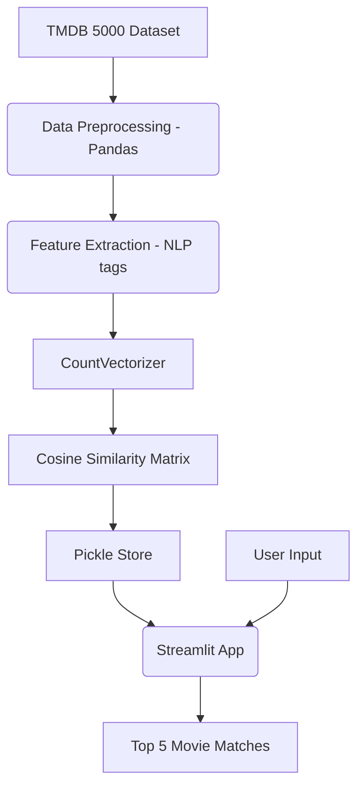

<div align="center">
  
  
  # 🎬 Movie Recommendation System
  
  <p>
    
    
    
    
  </p>
</div>

## 📖 Overview
The **Movie Recommendation System** utilizes content-based filtering algorithms and Natural Language Processing to suggest movies based on the user's preference. Built with Scikit-Learn and Pandas, the system is wrapped in a dynamic Streamlit frontend to deliver a smooth user experience.

## ✨ Features
- **Personalized Recommendations:** Get 5 similar movies based on what you love.
- **Cosine Similarity:** Uses advanced vector arithmetic to find conceptually similar movie plots and genres.
- **Fast Search & Filter:** Quick predictive search interface.
- **Poster Integration:** Fetches and displays real-time movie posters via TMDB API.

## 🛠️ Tech Stack
- **Machine Learning:** Scikit-Learn
- **Data Engineering:** Pandas, NLTK
- **Vectorization:** CountVectorizer
- **Frontend:** Streamlit

## 📂 Folder Structure
```text
Movie_Recommender/
├── app.py
├── model/
│   ├── similarity.pkl
│   └── movie_list.pkl
├── jupyter/
│   └── model_building.ipynb
├── requirements.txt
└── README.md
```

## 🚀 Installation

1. **Clone the repository:**
   ```bash
   git clone https://github.com/Satishkumara3/Movie-Recommendation-System.git
   cd Movie-Recommendation-System
   ```

2. **Install dependencies:**
   ```bash
   pip install -r requirements.txt
   ```

## 💡 Usage

```bash
streamlit run app.py
```
Navigate to `http://localhost:8501` to start getting recommendations!

## 📸 Screenshots
<div align="center">
  
  <p><i>Recommendation results UI</i></p>
</div>

## 🏗️ Architecture Diagram


## 📊 Results
- **Optimized Latency:** Inference happens instantly relying on the pre-computed similarity matrix.
- Accurately captures nuances between directors, cast, and genres for deep connections.

## 🔮 Future Improvements
- Implement collaborative filtering for user-based recommendations.
- Integrate a database to save user viewings.
- Add an autocomplete search bar for robust typo-handling.

## 📜 License
Provided under the MIT License.

## 🙏 Acknowledgements
- TMDB API
- Streamlit framework
