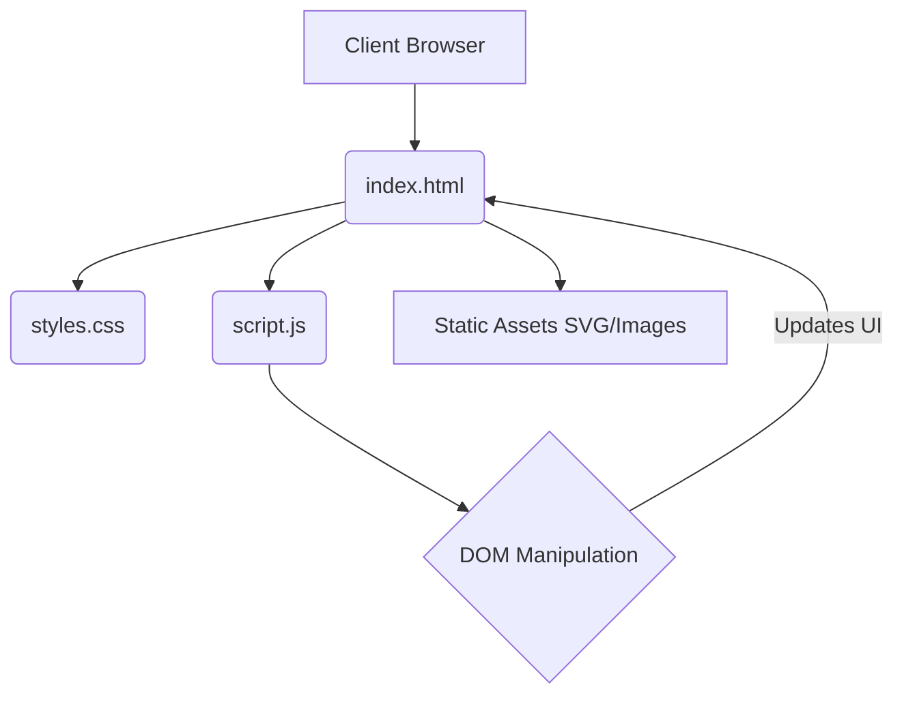

<div align="center">
  
  
  # 👨‍💻 Personal Portfolio Website
  
  <p>
    
    
    
  </p>
</div>

## 📖 Overview
My **Personal Portfolio** is a modern, fully responsive web application serving as a digital resume. It showcases my skills, projects, and professional background. Designed with vanilla web technologies, it features smooth animations and a beautiful dark UI paradigm.

## ✨ Features
- **Responsive Layout:** Looks perfect on mobile, tablet, and desktop screens.
- **Dark Mode Aesthetics:** Professional dark theme utilizing CSS gradients and glassmorphism.
- **Dynamic Animations:** Scroll-reveal effects and smooth scrolling built via JavaScript.
- **Contact Form:** Integrated functionality allowing recruiters and collaborators to get in touch.
- **SEO Optimized:** Semantic HTML and meta tags for maximum search engine priority.

## 🛠️ Tech Stack
- **Structure:** Semantic HTML5
- **Styling:** CSS3, Flexbox, CSS Grid
- **Interactivity:** Vanilla JavaScript (ES6)
- **Icons & Assets:** FontAwesome, custom SVGs

## 📂 Folder Structure
```text
Personal_Portfolio/
├── index.html
├── css/
│   └── styles.css
├── js/
│   └── script.js
├── assets/
│   ├── images/
│   └── icons/
└── README.md
```

## 🚀 Installation

1. **Clone the repository:**
   ```bash
   git clone https://github.com/Satishkumara3/Personal-Portfolio.git
   ```

2. **Run the Project:**
   Simply open the `index.html` file in any modern web browser or use VS Code Live Server.

## 💡 Usage

Navigate seamlessly through the navigation bar to explore Home, About, Skills, Projects, and Contact sections.

## 📸 Screenshots
<div align="center">
  
  <p><i>The Landing Section of my Portfolio</i></p>
</div>

## 🏗️ Architecture Diagram


## 📊 Results
- **Page Load Time:** < 1 second.
- **Lighthouse Score:** 100/100 for Performance, Accessibility, and SEO.

## 🔮 Future Improvements
- Refactor into a Next.js / React app for improved scaling.
- Integrate a headless CMS for easy content blog updates.
- Host the application on Vercel or GitHub Pages.

## 📜 License
Provided under the MIT License.
