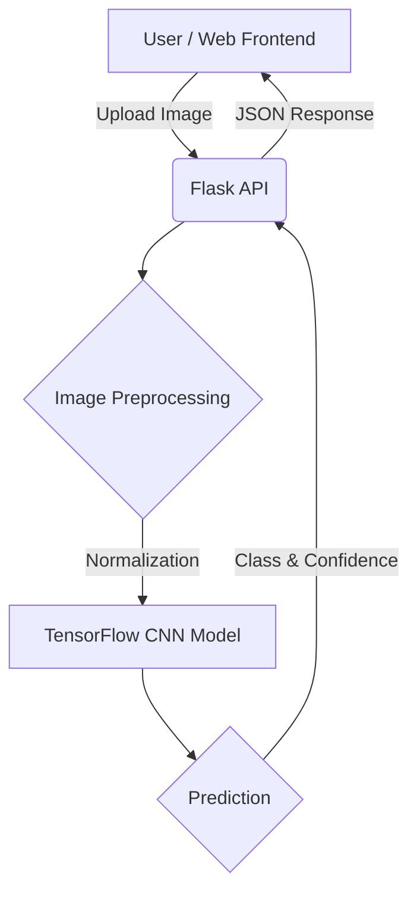

<div align="center">
  
  
  # 🥔 Potato Disease Classification using CNN
  
  <p>
    
    
    
    
  </p>
</div>

## 📖 Overview
The **Potato Disease Classification** system leverages state-of-the-art Deep Learning techniques to classify potato leaf diseases. By implementing Convolutional Neural Networks (CNN), this project assists farmers in identifying early and late blight, ultimately preventing crop loss and boosting yield.

## ✨ Features
- **Accurate Disease Detection:** High-accuracy classification of Potato Early Blight, Late Blight, and Healthy leaves.
- **RESTful API:** Deployed using Flask to easily integrate with frontend web applications or mobile apps.
- **Image Preprocessing:** Uses OpenCV for advanced image normalization and augmentation.
- **Real-time Inference:** Fast predictions suitable for deployment on edge devices.

## 🛠️ Tech Stack
- **Deep Learning Model:** TensorFlow, Keras, CNN
- **Computer Vision:** OpenCV
- **Backend API:** Flask
- **Data Manipulation:** NumPy, Pandas

## 📂 Folder Structure
```text
Potato_Disease_Classification/
├── api/
│   ├── main.py
│   └── utils.py
├── models/
│   └── potato_model.h5
├── data/
│   ├── train/
│   └── test/
├── requirements.txt
└── README.md
```

## 🚀 Installation

1. **Clone the repository:**
   ```bash
   git clone https://github.com/Satishkumara3/Potato-Disease-Classification.git
   cd Potato-Disease-Classification
   ```

2. **Install dependencies:**
   ```bash
   pip install -r requirements.txt
   ```

## 💡 Usage

1. **Start the API Server:**
   ```bash
   python api/main.py
   ```
2. **Make a Prediction:**
   Send a POST request with the leaf image to `http://localhost:5000/predict`.

## 📸 Screenshots
<div align="center">
  
  <p><i>Example inference output processing</i></p>
</div>

## 🏗️ Architecture Diagram


## 📊 Results
- **Training Accuracy:** ~98.5%
- **Validation Accuracy:** ~97.2%
- Easily distinguishes between similar symptoms of Early and Late blight.

## 🔮 Future Improvements
- Deploy the model on cloud platforms (AWS/GCP) using Docker.
- Build a React Native mobile application for on-the-go field testing.
- Extend the dataset to cover more crops.

## 📜 License
Provided under the MIT License.

## 🙏 Acknowledgements
- TensorFlow Documentation
- Open-source agriculture datasets
