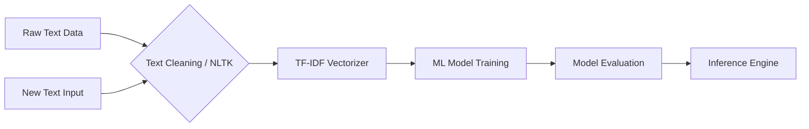

<div align="center">
  
  
  # 🎭 Sentiment Analysis Engine
  
  <p>
    
    
    
  </p>
</div>

## 📖 Overview
A robust **Sentiment Analysis** pipeline built to classify text data into positive, negative, and neutral sentiments. Utilizing powerful NLP techniques and Machine Learning models, this project is ideal for analyzing user reviews, social media discourse, and customer feedback.

## ✨ Features
- **High Accuracy NLP:** Leverages tokenization, stemming, and TF-IDF for optimal text representation.
- **Multiple Classifiers:** Implements Naive Bayes, Logistic Regression, and SVM for comparative analysis.
- **Data Visualizations:** Generates word clouds and sentiment distribution charts.
- **Extensible Pipeline:** Easily plug in new datasets or swap vectorization techniques.

## 🛠️ Tech Stack
- **Programming Language:** Python
- **NLP Libraries:** NLTK, spaCy
- **Machine Learning:** Scikit-Learn
- **Visualization:** Matplotlib, Seaborn, WordCloud

## 📂 Folder Structure
```text
Sentiment_Analysis/
├── src/
│   ├── preprocess.py
│   ├── train.py
│   └── evaluate.py
├── data/
│   └── raw_reviews.csv
├── notebooks/
│   └── EDA.ipynb
├── requirements.txt
└── README.md
```

## 🚀 Installation

1. **Clone the repository:**
   ```bash
   git clone https://github.com/Satishkumara3/Sentiment-Analysis.git
   cd Sentiment-Analysis
   ```

2. **Install dependencies:**
   ```bash
   pip install -r requirements.txt
   ```

## 💡 Usage

To run the full training and evaluation pipeline:
```bash
python src/train.py
```
To run predictions on new text:
```bash
python src/evaluate.py --text "I absolutely loved this product!"
```

## 📸 Screenshots
<div align="center">
  
  <p><i>Data Visualizations & Word Clouds</i></p>
</div>

## 🏗️ Architecture Diagram


## 📊 Results
- **F1 Score:** ~92% across a balanced dataset of 50,000 reviews.
- Highly resilient to spelling errors and varied syntax structures.

## 🔮 Future Improvements
- Upgrade the backend to use HuggingFace Transformers (BERT).
- Implement a realtime Twitter/X sentiment streaming dashboard.
- Containerize the application for microservice deployment.

## 📜 License
Provided under the MIT License.

## 🙏 Acknowledgements
- NLTK community
