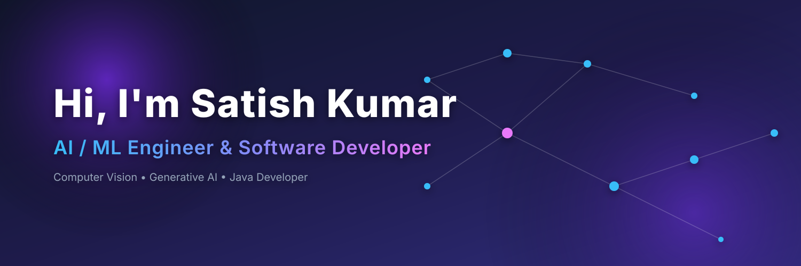

  

  

  

## 👨‍💻 About Me

<table align="center" width="100%" border="0">
  <tr>
    <td width="55%">
      <ul style="list-style-type: none;">
        <li>🎓 <strong>B.Tech</strong> Computer Science Engineering Student</li>
        <li>🚀 Aspiring <strong>AI/ML Engineer</strong> & <strong>Backend Developer</strong></li>
        <li>🧠 Passionate about <strong>Deep Learning</strong>, <strong>Computer Vision</strong>, and <strong>NLP</strong></li>
        <li>🤖 Exploring the potential of <strong>Generative AI</strong> (LLMs, RAG, LangChain)</li>
        <li>🤝 Open to collaborations on open-source AI projects</li>
        <li>⚡ <strong>Fun Fact:</strong> I can debug code while half asleep!</li>
        <li>🎯 <strong>Current Learning:</strong> Advanced RAG and Agentic workflows</li>
        <li>🌟 <strong>Future Goals:</strong> Contribute to leading AI frameworks and build AGI accessible tools</li>
      </ul>
    </td>
    <td width="45%" align="center">
      
    </td>
  </tr>
</table>

  

## 🛠️ Skills & Tech Stack

### Languages

  
  
  
  

### AI & Machine Learning

  
  
  
  
  
  

### Frameworks & Tools

  
  
  
  
  
  

  

## 🚀 Featured Projects

<table width="100%">
  <tr>
    <td width="50%">
      <h3>🥔 Potato Disease Classification</h3>
      
A CNN-based image classification model using TensorFlow and OpenCV to detect diseases in potato leaves. Served via Flask API.

      

        
        
      

    </td>
    <td width="50%">
      <h3>📄 Gen AI Document Studio</h3>
      
An AI-powered document assistant utilizing RAG, FAISS, and LangChain to extract meaning from PDFs. Streamlit frontend.

      

        
        
      

    </td>
  </tr>
  <tr>
    <td width="50%">
      <h3>🎬 Movie Recommendation System</h3>
      
A content-based recommendation system built with Scikit-Learn. Deployed dynamically on a Streamlit application.

      

        
        
      

    </td>
    <td width="50%">
      <h3>🏦 Bank Management System</h3>
      
A robust backend software built entirely in Java, demonstrating Object-Oriented design and SQL database management.

      

        
        
      

    </td>
  </tr>
</table>

  

## 📈 GitHub Analytics

  
    
  

   
  <!-- Contribution Snake -->
  <picture>
    <source media="(prefers-color-scheme: dark)" srcset="https://raw.githubusercontent.com/Satishkumara3/Satishkumara3/output/github-contribution-grid-snake-dark.svg">
    <source media="(prefers-color-scheme: light)" srcset="https://raw.githubusercontent.com/Satishkumara3/Satishkumara3/output/github-contribution-grid-snake.svg">
    
  </picture>

  

## 🌐 Connect With Me

  
  
  
  

 

  
    
  <i>"Any fool can write code that a computer can understand. Good programmers write code that humans can understand." – Martin Fowler</i>

  

